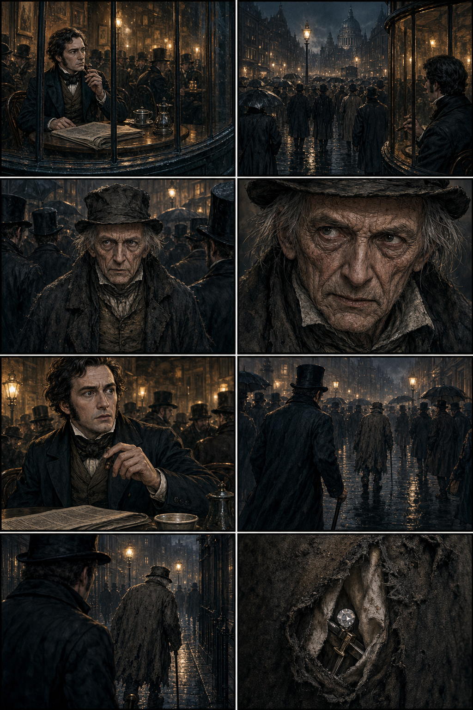

# Day-24 Benchmark: The Man of the Crowd

This benchmark applies the startup plan to a public-domain Edgar Allan Poe scene. It covers the coffeehouse encounter through the narrator's decision to follow the old man.



## Deliverables

- canonical Story Bible and source evidence;
- two approved recurring character definitions;
- two approved locations and six continuity-sensitive props;
- three semantic scenes and four ordered events;
- an approved eight-panel adaptation plan;
- visual direction and image-generation prompt;
- storyboard asset and provenance after generation;
- continuity findings, approval history, and reproducible export bundle;
- Day-24 decision review.

## Verified Result

- 2 canonical characters
- 2 locations
- 6 continuity-sensitive props
- 4 ordered events
- 3 semantic scenes
- 8 approved panels
- 1 approved storyboard asset
- 3 approval records
- 0 continuity findings
- 6 passing automated tests

See [day24-decision-review.md](day24-decision-review.md) for the completion audit and next validation gate.

## Rebuild

Without a visual asset:

```bash
python benchmarks/man_of_the_crowd/build_benchmark.py
```

With the generated storyboard:

```bash
python benchmarks/man_of_the_crowd/build_benchmark.py \
  --storyboard benchmarks/man_of_the_crowd/man-of-the-crowd-storyboard.png
```

The build is deterministic except for generated visual content. The export records the storyboard hash so later revisions remain traceable.
